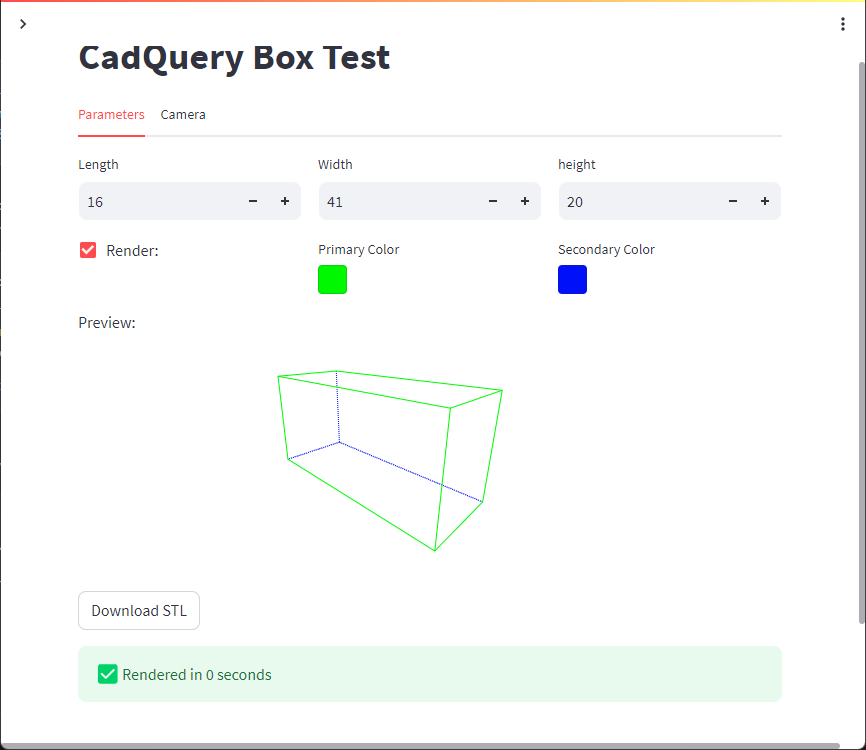

# CadQuery Box Test - Streamlit Example



View the demo as a [Streamlit App](cqboxtest.streamlit.app)

## To run Locally

1. Download the code
2. Open a command line where the code resides
3. Install streamlit
    ``` bash
    pip install streamlit
    ```
4. Install cadquery
    ```
    pip install cadquery
    ```
5. Run the streamlit app
    ```
    streamlit run app.py
    ```
6. If everything worked; a browser should be opened to your local instance.